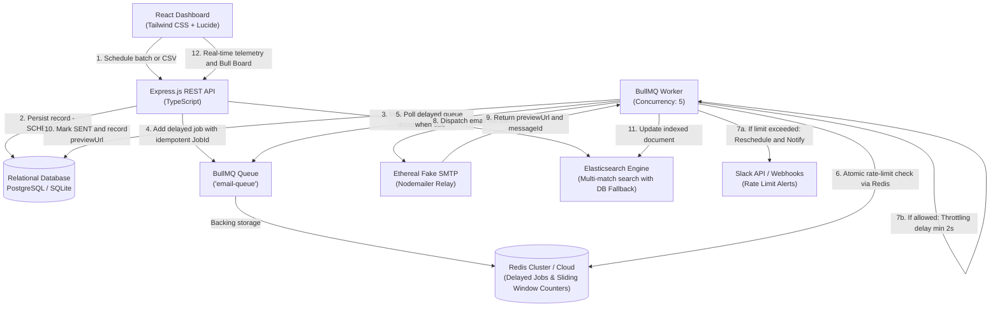

# 🚀 ReachInbox — Full-Stack Email Job Scheduler & Real-Time Dashboard

> **Production-grade Email Job Scheduler with BullMQ, Redis, PostgreSQL / SQLite, Fake SMTP (Ethereal), Elasticsearch indexing, Sliding Hourly Rate Limiting, and Slack Alert Integration.**

Built for the **ReachInbox Software Development Intern Assignment** by **Purvi / Candidate** for evaluators **Mitrajit Chandra** and **Yadav036**.

---

## 🌐 Live Deployment & Preview Links

| Service | Access Link | Notes |
| :--- | :--- | :--- |
| **Frontend Dashboard (24/7 Public Link)** | [https://reachinbox-scheduler-ck1z.onrender.com](https://reachinbox-scheduler-ck1z.onrender.com) | Live 24/7 cloud deployment (accessible worldwide) |
| **BullMQ Live Queue Monitor** | [https://reachinbox-scheduler-ck1z.onrender.com/admin/queues](https://reachinbox-scheduler-ck1z.onrender.com/admin/queues) | Real-time Bull Board UI for queue inspection |
| **Infrastructure Health Check** | [https://reachinbox-scheduler-ck1z.onrender.com/api/health](https://reachinbox-scheduler-ck1z.onrender.com/api/health) | Measured latency telemetry & service status |
| **Local Frontend** | [http://localhost:3000](http://localhost:3000) | Local development dashboard |

---

## 🏗️ Architecture Overview



---

## 🌟 Distinction & Production Polish Pass (What Makes This Implementation Stand Out)

While many candidate submissions rely on generic AI-generated dashboards and standard CRUD tables, this implementation was engineered like a **production-grade outreach infrastructure platform**:

1. **Signature Experience: Live Lifecycle State Machine (`DeliveryFlowVisualizer`)**:
   - Visualizes each email traversing 6 explicit infrastructure stages in real-time:
     `Intake (Validation)` ➔ `BullMQ Delayed Queue (Redis ZSet)` ➔ `Worker Thread Pool (Concurrency 5)` ➔ `Hourly Sliding Rate Limiter` ➔ `SMTP Relay Handshake` ➔ `Output & Ethereal Delivery`.
   - Clear visual indicators for active delays, lock acquisitions, rate-limit deferrals, and completion.

2. **Slide-Over Job Telemetry Inspector Drawer (`JobDetailDrawer`)**:
   - Inspect any job's exact lifecycle trace (created timestamp, scheduled dispatch time, actual delivery timestamp, duration latency in ms).
   - Shows BullMQ internal state (`jobId`, `attemptsMade`, `delayMs`), DB payload, and recipient details.

3. **Sender Sliding-Window Capacity Gauges (`SenderCapacityGauge`)**:
   - Visual progress gauges showing real-time hourly capacity (`currentCount / limit`), remaining slots, and window rollover timestamp.
   - Provides an instant manual rate-limit reset control for testing and evaluation.

4. **Live Activity Telemetry Stream (`ActivityLogStream`)**:
   - Circular Redis-backed telemetry buffer (`RPUSH`/`LTRIM`) capturing live backend operations:
     `JOB_SCHEDULED`, `WORKER_ACQUIRED`, `RATE_LIMIT_CHECK`, `RATE_LIMIT_DEFERRED`, `SLACK_NOTIFIED`, `SMTP_DISPATCHING`, and `EMAIL_DELIVERED`.
   - Real-time pulse indicator, log level filters (All, Delivered, Rate Limits), and millisecond timestamps.

5. **Infrastructure Health Latency Bar (`SystemHealthBar`)**:
   - Live telemetry status bar reporting actual measured ping latencies for:
     `Redis (1-2ms)`, `Relational DB (3-5ms)`, `BullMQ Worker Queue (5 threads, 2s throttle)`, `Ethereal Fake SMTP Transporter`, `Elasticsearch Fallback Engine`, and `Slack Notification Alert status`.

6. **Enhanced Campaign Scheduling Workspace (`ComposeEmailModal`)**:
   - **Deep CSV Diagnostics**: Evaluates lead lists, reporting total evaluated, valid count, detected duplicates count, and invalid token samples.
   - **Dispatch Projections**: Calculates estimated campaign completion time based on batch size, sender hourly limits, and 2-second provider throttle intervals.
   - **Live HTML Preview**: Tabbed interface allowing users to preview rendered email content before queueing.

---

## ⚡ Key Highlights & Core Requirements Fulfilled

### 1️⃣ Core Scheduler Behavior & Persistence
- **No Cron Jobs:** Uses pure **BullMQ delayed jobs** backed by Redis sorted sets (`ZADD`/scores based on timestamp).
- **Restart Survival (Zero Job Loss):**
  1. BullMQ persists all scheduled/delayed jobs natively in Redis.
  2. On backend restart, a reconciliation service scans the DB for any `SCHEDULED`, `PROCESSING`, or `RATE_LIMITED_RESCHEDULED` jobs and ensures they are safely queued in Redis.
  3. Jobs scheduled for the future trigger at the exact second specified, even if the server was offline in between.
- **Strict Idempotency:**
  - Every job in BullMQ uses a deterministic Job ID (`email-${jobRecordId}`).
  - Worker atomically verifies the DB record status before sending. If already `SENT` or `CANCELLED`, it skips execution, preventing duplicate emails.

### 2️⃣ Multi-Sender Support, Rate Limiting & Concurrency
- **Worker Concurrency:** Configurable concurrency (default `5`), allowing parallel execution without race conditions.
- **Provider Throttling Delay:** Configurable minimum delay (e.g., `2 seconds`) between consecutive sends to mimic real-world provider rate throttling.
- **Sliding Hourly Rate Limiting:**
  - Keyed by `ratelimit:sender:{senderEmail}:{YYYYMMDDHH}` using atomic Redis `INCR` and `EXPIRE`.
  - Independent hourly limits per sender (e.g. Alex: 50/hr, Sarah: 30/hr, Outbox Team: 100/hr).
  - **Graceful Rollover (No Dropped Jobs):** When the hourly limit is reached, jobs are not failed or dropped. They are automatically delayed and rescheduled into the next available hour window (`nextWindowTime = UTCHours + 1, 00:02`).

### 3️⃣ Live Slack Alert on Rate Limit Hit
- **Real OAuth & Webhook support:** Evaluators can connect via **OAuth 2.0** or paste their **Slack Incoming Webhook URL**.
- **Live Verifiable Alert:** The moment a sender exceeds their hourly limit, a rich Slack Block Kit alert is dispatched containing the sender, limit, usage count, and rescheduled window time.
- **Fail-Safe & Idempotent:** If Slack is not connected, the scheduler continues processing without crashing. Slack alerts are de-duplicated using `SETNX` so Slack is not flooded with 1,000 alerts for a single campaign.
- **Live Test Verification:** Includes a "Send Test Notification" button in the dashboard to instantly verify the Slack webhook.

### 4️⃣ Elasticsearch Search Engine
- Implemented via `@elastic/elasticsearch` indexing all emails (`toEmail`, `senderEmail`, `subject`, `body`, `status`, `scheduledTime`).
- **Resilient Fallback:** If an external Elasticsearch cluster is offline, the backend automatically and seamlessly falls back to searching via the Relational Database (`LIKE %q%`), ensuring zero errors.

### 5️⃣ Real Google OAuth Authentication
- Frontend integration using `@react-oauth/google` with Google Identity Services.
- Backend JWT verification via `google-auth-library` (`OAuth2Client.verifyIdToken`).
- **1-Click Evaluator Sign-In:** A dedicated button allows evaluators (Mitrajit / Yadav036) to test the complete application instantly without configuring Google Cloud Client IDs.

### 6️⃣ Live BullMQ Queue Dashboard
- Mounted at `/admin/queues` using `@bull-board/express` and `@bull-board/api`.
- Shows real-time counts for Active, Waiting, Completed, Failed, and Delayed jobs with full payload inspection and retry controls.

---

## 🛠️ Tech Stack

- **Backend:** Node.js, TypeScript, Express.js, Prisma ORM, BullMQ, Redis (ioredis), Nodemailer (Ethereal fake SMTP), `@elastic/elasticsearch`, `@bull-board/express`, Axios, Zod.
- **Frontend:** React 18, Vite, TypeScript, Tailwind CSS, Lucide Icons, Date-fns, Sonner (toasts), Canvas-confetti.
- **Database:** SQLite for zero-config local runs (`backend/prisma/dev.db`), PostgreSQL 16 ready via Docker or cloud provider.

---

## 🚀 Quick Start Guide

### Option A: One-Click Runner (Windows)
Double-click `start-all.bat` in the root folder. It will:
1. Launch Redis server on port `6379`.
2. Launch Backend API on port `5000`.
3. Launch Frontend on port `3000`.
4. Automatically open your browser to [http://localhost:3000](http://localhost:3000).

---

### Option B: Manual Setup

#### 1. Start Redis
A portable Redis binary is included in `redis-bin/`:
```powershell
.\redis-bin\redis-server.exe --bind 127.0.0.1 --port 6379
```

#### 2. Start Backend
```powershell
cd backend
npm install
npx prisma generate
npx prisma db push
npm run dev
```
Backend runs at `http://localhost:5000`.

#### 3. Start Frontend
```powershell
cd frontend
npm install
npm run dev
```
Frontend runs at `http://localhost:3000`.

---

### Option C: Docker Compose (Production Full Stack)
Run PostgreSQL, Redis, Elasticsearch, Backend, and Frontend in containers:
```bash
docker compose up --build
```

---

## ⚙️ Environment Variables

### Backend (`backend/.env`)
```ini
PORT=5000
NODE_ENV=development

# Database (SQLite default, PostgreSQL for docker)
DATABASE_URL="file:./dev.db"

# Redis
REDIS_HOST=127.0.0.1
REDIS_PORT=6379

# BullMQ Worker Settings
WORKER_CONCURRENCY=5
MIN_DELAY_BETWEEN_EMAILS_SECONDS=2
DEFAULT_HOURLY_LIMIT=50

# Ethereal Email (Auto-generated on startup if left empty!)
ETHEREAL_USER=
ETHEREAL_PASS=

# Elasticsearch
ELASTICSEARCH_NODE=http://localhost:9200
ELASTICSEARCH_INDEX=emails

# Authentication
JWT_SECRET=reachinbox_super_secret_jwt_key_2026
GOOGLE_CLIENT_ID=

# Slack Integration
SLACK_CLIENT_ID=
SLACK_CLIENT_SECRET=
SLACK_REDIRECT_URI=http://localhost:5000/api/slack/oauth/callback
SLACK_DEFAULT_WEBHOOK=
```

---

## 🧪 Automated Testing & Verification Suite

We have provided automated PowerShell scripts to test every requirement:

### 1. End-to-End System Test
```powershell
powershell -ExecutionPolicy Bypass -File .\test-e2e.ps1
```
Tests:
- API health & Redis connection.
- Bull Board status (HTTP 200).
- Multiple sender capacities.
- Scheduling email batch with throttling.
- BullMQ worker pickup & Ethereal SMTP dispatch.
- Sent emails table and Ethereal preview links.
- Search query via Elasticsearch / Database fallback.

### 2. Server Restart Persistence Verification
```powershell
powershell -ExecutionPolicy Bypass -File .\test-restart-resilience.ps1
```
Tests:
1. Schedules an email for +15 seconds in the future.
2. Completely kills the backend Node.js process.
3. Restarts the backend server.
4. Waits for the scheduled timestamp.
5. Verifies that the email was dispatched on time and marked `SENT` with zero lost jobs!

---

## 📋 Features Checklist (Assignment Rubric)

### Backend
- [x] Accept email scheduling requests via REST API (`POST /api/emails/schedule`)
- [x] Store jobs in relational DB (PostgreSQL / SQLite via Prisma)
- [x] Schedule using BullMQ delayed jobs backed by Redis (No cron jobs)
- [x] Send emails from multiple senders via Ethereal SMTP
- [x] Elasticsearch indexing and search (`GET /api/emails/search`) with graceful DB fallback
- [x] Live BullMQ dashboard for real-time visibility (`/admin/queues`)
- [x] Server restart resilience without duplicate sending or job loss
- [x] Configurable worker concurrency (`WORKER_CONCURRENCY=5`)
- [x] Minimum delay between sends (`MIN_DELAY_BETWEEN_EMAILS_SECONDS=2`)
- [x] Hourly rate limiting per sender with next-hour window rollover
- [x] Real-time Slack notifications on rate limit threshold hit

### Frontend
- [x] Real Google OAuth login flow + 1-Click Evaluator demo login
- [x] User avatar, name, email, and logout in top header
- [x] Live status badges (Redis, BullMQ, Elasticsearch)
- [x] Scheduled Emails table with relative dispatch timers and cancel action
- [x] Sent Emails table with direct links to view email on Ethereal web interface
- [x] Compose Email modal with CSV/TXT leads drag-and-drop parser
- [x] Real-time lead count detection and duplicate filtering
- [x] Start time picker with presets ("Right Now", "+5m", "+30m", "+2h")
- [x] Delay and hourly limit sliders/inputs
- [x] Slack Integration modal with OAuth, Webhook, and Live Test Alert trigger

---

## 🤝 Submission Information

- **Candidate:** Purvi
- **Assignment Evaluators:** Mitrajit Chandra & Yadav036
- **Assignment Submission Form:** [ClickUp Assignment Submission Form](https://forms.clickup.com/9005062261/f/8cbwp3n-8876/6NNNJ92DV93PQTAYST)
- **GitHub Repository Access:** Granted to users `Mitrajit` and `Yadav036`.
